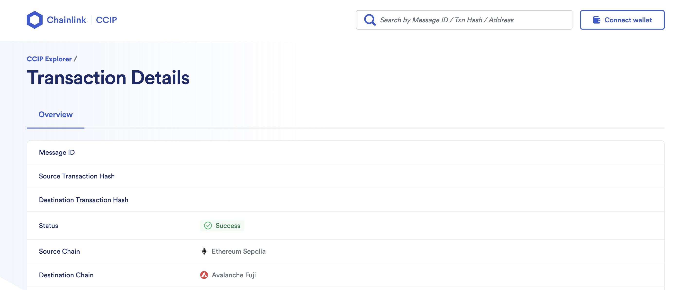

Results:
set-up:

npx hardhat deploy-source-chain
ℹ️  Attempting to deploy CrossChainNameServiceLookup on the ethereumSepolia blockchain using 0x1bF44b510871d45989E7524F97D7F2cB29aEB901 address
✅ CrossChainNameServiceLookup deployed at address 0x9d87D82D9C0dE2826CB2cBF43d8243b4a5F56735 on ethereumSepolia blockchain
ℹ️  Attempting to deploy CrossChainNameServiceRegister on the ethereumSepolia blockchain using 0x1bF44b510871d45989E7524F97D7F2cB29aEB901 address
✅ CrossChainNameServiceRegister deployed at address 0x35456f1c32995311597bc94d2cAC17b5D282d595 on ethereumSepolia blockchain
ℹ️  Attempting to call the setCrossChainNameServiceAddress function on the CrossChainNameSServiceLookup smart contract
✅ CCNS Address set, transaction hash: 0x637e14e0f19b27a189dc88000c067eaa27030b956a14dd2cb89111d5c7d78b47
✅ Task deploy-source-chain finished with the execution

npx hardhat deploy-destination-chain-step1 --network avalancheFuji
ℹ️  Attempting to deploy CrossChainNameServiceLookup on the avalancheFuji blockchain usingg 0x1bF44b510871d45989E7524F97D7F2cB29aEB901 address
✅ CrossChainNameServiceLookup deployed at address 0x4c72d588Aa7B8132f9F1F607A1B330f44ba2BdF0 on avalancheFuji blockchain
ℹ️  Attempting to deploy CrossChainNameServiceReceiver on the avalancheFuji blockchain    
✅ CrossChainNameServiceReceiver deployed at address 0xb1Ce19CbcDe0a68BCA4656719a930332aaBA7bF7 on avalancheFuji blockchain
ℹ️  Attempting to call the setCrossChainNameServiceAddress function on the CrossChainNameSServiceLookup smart contract
✅ CCNS Address set, transaction hash: 0x5d50985c28c0f398eb02752c74d3f71828db742f1fec9478b0fd6bf34df4e7cb
✅ Task deploy-destination-chain-step1 finished with the execution


npx hardhat fund --amount 100000000000000000
ℹ️  Attempting to send 100000000000000000 wei to CrossChainNameServiceRegister smart contrract (0x35456f1c32995311597bc94d2cAC17b5D282d595) on the ethereumSepolia blockchain        
✅ Transaction hash: 0x9ce22d979e85bbc3d43130bb9f146cd712ecc0e71dd3b28c34345c2b9d6bec84   
✅ Task fund finished with the execution

npx hardhat get-balance
ℹ️  CrossChainNameServiceRegister balance (in wei): 100000000000000000

npx hardhat ccns-register --ccns-name anon.ccns
ℹ️  Attempting to call the register function on the CrossChainNameServiceRegister smart coontract with the name anon.ccns on the ethereumSepolia blockchain
✅ Transaction hash: 0xeff511ffdee04a78c72a5035c2f9bd20d012fd4935187b1e032260d28e3f272a   
✅ Task ccns-register finished with the execution

npx hardhat ccns-lookup --ccns-name anon.ccns --network ethereumSepolia
ℹ️  anon.ccns resolved with 0x1bF44b510871d45989E7524F97D7F2cB29aEB901

npx hardhat ccns-lookup --ccns-name anon.ccns --network avalancheFuji
ℹ️  anon.ccns resolved with 0x0000000000000000000000000000000000000000

npx hardhat run scripts/deploy-destination-chain-step2.ts --network avalancheFuji
Deploying contracts with the account: 0x1bF44b510871d45989E7524F97D7F2cB29aEB901
Enabling chain...
Chain enabled with transaction hash: 0xb6f97940e3275b9e9045fec2c69a406e3a5db71e57d9af2a9e40993ab694d47a

npx hardhat test --network hardhat
 CCIP Cross Chain Name Service - Register Alice, Lookup Alice and Return her EOA address from both chains
alice's address:  0xf39Fd6e51aad88F6F4ce6aB8827279cffFb92266
CCIP Local simulator address:  0x5FbDB2315678afecb367f032d93F642f64180aa3
CrossChainNameServiceLookup address:  0xe7f1725E7734CE288F8367e1Bb143E90bb3F0512
CrossChainNameServiceRegister address:  0x9fE46736679d2D9a65F0992F2272dE9f3c7fa6e0
CrossChainNameServiceLookup address:  0xCf7Ed3AccA5a467e9e704C703E8D87F634fB0Fc9
CrossChainNameServiceReceiver address:  0xDc64a140Aa3E981100a9becA4E685f962f0cF6C9
sourceSetCrossChainNameServiceAddress transaction:  0xce42a03c29ba01b95d7ae036dfbf7f7601329bae903b1b3a11436f89a4b6589d
destinationSetCrossChainNameServiceAddress transaction:  0x43e0224bb6bcf70fc4b4aa0ad66d1d6757150e0a028d25fdeb95b28df21019d8
sourceEnableChain transaction:  0xc707b256f09a426920ecb1c0c33e6ecf78a9ad98ad1f8d14f19538114ac4b712

Registration successful:
Returned source Lookup address:  0xf39Fd6e51aad88F6F4ce6aB8827279cffFb92266
Returned destination Lookup address:  0xf39Fd6e51aad88F6F4ce6aB8827279cffFb92266
    ✔ Should register alice.ccns on the source chain and check that the registering address is the same on both chains (57ms)

  1 passing (1s)


## CCIP Cross Chain Name Service

> **Note**
>
> _This repository represents an example of using a Chainlink product or service. It is provided to help you understand how to interact with Chainlink’s systems so that you can integrate them into your own. This template is provided "AS IS" without warranties of any kind, has not been audited, and may be missing key checks or error handling to make the usage of the product more clear. Take everything in this repository as an example and not something to be copy pasted into a production ready service._

This project is an educational example of how to create a minimal cross-chain name service using Chainlink CCIP.

## Prerequisites

- [Git](https://git-scm.com/book/en/v2/Getting-Started-Installing-Git)
- [Current LTS Node.js version](https://nodejs.org/en/about/releases/)

Verify installation by typing:

```shell
node -v
```

and

```shell
npm -v
```

## Getting Started

1. Clone the repository

```
git clone https://github.com/smartcontractkit/ccip-cross-chain-name-service.git
cd ccip-cross-chain-name-service
```

2. Install packages

```
npm install
```

3. Compile contracts

```
npx hardhat compile
```

## What are we building?


This is a basic architecture diagram, this project can have as many Chainlink CCIP-supported blockchains as possible, it is not limited to three as the diagram may suggest.

There is only one source blockchain on which we can register our `.ccns` handles. It is set by default to `ethereumSepolia` but you can change it by adjusting the `defaultNetwork` property of the `config` object in the `hardhat.config.ts` file:

```ts
const config: HardhatUserConfig = {
  solidity: "0.8.19",
  defaultNetwork: 'ethereumSepolia', // Source Chain
  ...
}
```

There can be as many Chainlink CCIP-supported destination blockchains as possible.

There are two CrossChainNameService smart contracts per blockchain:

1. On the source blockchain, [`CrossChainNameServiceRegister`](./contracts/CrossChainNameServiceRegister.sol) and [`CrossChainNameServiceLookup`](./contracts/CrossChainNameServiceLookup.sol)
2. On each of the destination blockchains, [`CrossChainNameServiceReceiver`](./contracts/CrossChainNameServiceReceiver.sol) and [`CrossChainNameServiceLookup`](./contracts/CrossChainNameServiceLookup.sol)

To register a new `.ccns` handle, you need to call the `register()` function of the [`CrossChainNameServiceRegister`](./contracts/CrossChainNameServiceRegister.sol) smart contract. It will send the CCIP message to all [`CrossChainNameServiceReceiver`](./contracts/CrossChainNameServiceReceiver.sol)s on each destination blockchain.

To resolve any give `.ccns` name, you just need to call a free view `lookup(name)` function of [`CrossChainNameServiceLookup`](./contracts/CrossChainNameServiceLookup.sol) **on any blockchain**. Because it is a cross-chain system, it will be exactly the same on all supported blockchains.

## Usage

There are several Hardhat tasks available for deployment and interaction with this project. But before that, you need to set up some environment variables.

We are going to use the [`@chainlink/env-enc`](https://www.npmjs.com/package/@chainlink/env-enc) package for extra security. It encrypts sensitive data instead of storing them as plain text in the `.env` file, by creating a new, `.env.enc` file. Although it's not recommended to push this file online, if that accidentally happens your secrets will still be encrypted.

1. Set a password for encrypting and decrypting the environment variable file. You can change it later by typing the same command.

```
npx env-enc set-pw
```

2. Now set the following environment variables: `PRIVATE_KEY`, Source Blockchain RPC URL, Destination Blockchain RPC URL. You can see available options in the `.env.example` file:

```
PRIVATE_KEY=""
ETHEREUM_SEPOLIA_RPC_URL=""
OPTIMISM_SEPOLIA_RPC_URL=""
ARBITRUM_SEPOLIA_RPC_URL=""
AVALANCHE_FUJI_RPC_URL=""
POLYGON_AMOY_RPC_URL=""
BNB_CHAIN_TESTNET_RPC_URL=""
BASE_SEPOLIA_RPC_URL=""
KROMA_SEPOLIA_RPC_URL=""
WEMIX_TESTNET_RPC_URL=""
GNOSIS_CHIADO_RPC_URL=""
CELO_ALFAJORES_RPC_URL=""
```

To set these variables, type the following command and follow the instructions in the terminal:

```
npx env-enc set
```

After you are done, the `.env.enc` file will be automatically generated.

If you want to validate your inputs you can always run the next command:

```shell
npx env-enc view
```

### Deployment

#### Source Chain (Only Once)

As being said, on the source blockchain there are [`CrossChainNameServiceRegister`](./contracts/CrossChainNameServiceRegister.sol) and [`CrossChainNameServiceLookup`](./contracts/CrossChainNameServiceLookup.sol) smart contracts. To deploy them we are going to use the `deploy-source-chain` task.

```shell
npx hardhat deploy-source-chain
--router <SOURCE_CHAIN_ROUTER_ADDRESS> # Optional
```

As being said, the source chain is set up as `defaultNetwork` property of the `config` object in the `hardhat.config.ts` file.

For example, to deploy these two contracts on ethereumSepolia (default source chain), run:

```shell
npx hardhat deploy-source-chain
```

Optionally, if you want to manually provide the CCIP Router.sol smart contract address, use the `--router` flag:

```shell
npx hardhat deploy-source-chain --router <SOURCE_CHAIN_ROUTER_ADDRESS>
```

#### Destination Chain (Each time you want to enable a new blockchain)

As being said, on each destination blockchain there are [`CrossChainNameServiceReceiver`](./contracts/CrossChainNameServiceReceiver.sol) and [`CrossChainNameServiceLookup`](./contracts/CrossChainNameServiceLookup.sol) smart contracts. To deploy them we are going to use two tasks:
`deploy-destination-chain-step1` & `deploy-destination-chain-step2`

To deploy these two smart contracts on the destination blockchain, you need to use the `deploy-destination-chain-step1` task:

```shell
npx hardhat deploy-destination-chain-step1
--router <DESTINATION_CHAIN_ROUTER_ADDRESS> # Optional
--register <SOURCE_CHAIN_CCNS_REGISTER> # Optional
--source-chain-selector <SOURCE_CHAIN_SELECTOR> # Optional
```

For example, if you want to deploy them to Avalanche Fuji testnet, run:

```shell
npx hardhat deploy-destination-chain-step1 --network avalancheFuji
```

To link these two contracts with the CrossChainNameServiceRegister smart contract on the source blockchain, you need to use the `deploy-destination-chain-step2` task:

```shell
npx hardhat deploy-destination-chain-step2
--receiver-network <CCNS_RECEIVER_BLOCKCHAIN>
--register <CCNS_REGISTER_ADDRESS> # Optional
--receiver <CCNS_RECEIVER_ADDRESS> # Optional
--destination-chain-selector <DESTINATION_CHAIN_SELECTOR> # Optional
```

For example, to enable Avalanche Fuji as a new network in the Cross Chain Name Service project, run:

```shell
npx hardhat deploy-destination-chain-step2 --receiver-network avalancheFuji
```

**Each time you want to enable a new blockchain, repeat the previous two steps.**

### Fee Management

For simplicity, this project supports paying for CCIP fees in native coins only.

#### Funding

To fund the CrossChainNameServiceRegister contract, we are going to use the `fund` task:

```shell
npx hardhat fund
--amount <AMOUNT_IN_WEI>
--register <CCNS_REGISTER_ADDRESS> # Optional
```

For example, to fund your CrossChainNameServiceRegister smart contract on Ethereum Sepolia with 0.1 ether (in wei), run:

```shell
npx hardhat fund --amount 100000000000000000
```

#### Checking balance

To check the balance (in wei) of CrossChainNameServiceRegister smart contract, you can use the `get-balance` task:

```shell
npx hardhat get-balance
--register <CCNS_REGISTER_ADDRESS> # Optional
```

For example, to check the balance of CrossChainNameServiceRegister smart contract, run:

```shell
npx hardhat get-balance
```

#### Withdrawing

To withdraw all of the locked funds in the CrossChainNameServiceRegister contract, you can use the `withdraw` task:

```shell
npx hardhat withdraw
--beneficiary <ADDRESS_TO_WITHDRAW_FUNDS_TO>
--register <CCNS_REGISTER_ADDRESS> # Optional
```

For example, to withdraw everything from CrossChainNameServiceRegister, run:

```shell
npx hardhat fund --beneficiary <PUT_YOUR_ADDRESS_HERE>
```

### Interaction

Now comes the fun part, using the project!

#### Register New CCNS Handle

To register a new CCNS handle we are going to use the `ccns-register` task. Keep in mind that provided handle must end with `.ccns``:

```shell
npx hardhat ccns-register
--ccns-name <NAME.CCNS>
--register <CCNS_REGISTER_ADDRESS> # Optional
```

For example, if you want to register the `anon.ccns` handle, run:

```shell
npx hardhat ccns-register --ccns-name anon.ccns
```

The task will output the transaction hash in the terminal. Using it, search for your CCIP message(s) in the [CCIP Explorer](https://ccip.chain.link), one per destination blockchain. Once all of them are finalized, you have successfully registered your new & unique `.ccns` handle.



#### Resolve CCNS Handle to the actual wallet address

To check which address is associated with which `.ccns` handle you can use the `ccns-lookup` task or query the [`CrossChainNameServiceLookup`](./contracts/CrossChainNameServiceLookup.sol) smart contract manually on each supported blockchain:

```shell
npx hardhat ccns-lookup
--ccns-name <NAME.CCNS>
--lookup <CCNS_LOOKUP_ADDRESS> # Optional
```

To resolve the `anon.ccns` handle to an actual address on Ethereum Sepolia, run:

```shell
npx hardhat ccns-lookup --ccns-name anon.ccns --network ethereumSepolia
```

To do the same thing on Avalanche Fuji, run:

```shell
npx hardhat ccns-lookup --ccns-name anon.ccns --network avalancheFuji
```

It should log the same address. If it logs the zero address on any of the destination blockchains double-check the CCIP explorer to confirm that the `register` message is being finalized.
